# PGaaS - Postgres as a Service

Platform-managed CloudNativePG PostgreSQL clusters provisioned per client (INS code), with environment-aware configuration merging, mutual TLS (mTLS) certificate chains, declarative role management, and automated backups via S3-compatible storage.

## Architecture Overview

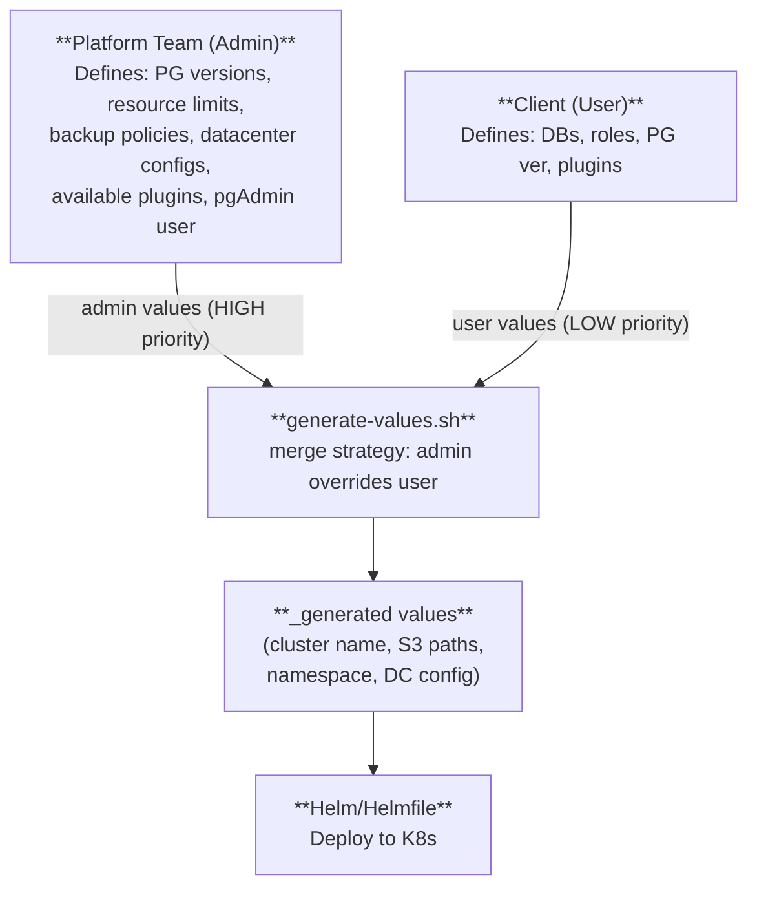

### Per-Instance Cluster Topology

Each client (INS) instance is deployed as an independent CNPG cluster per datacenter, with pgAdmin backed by LDAP and backups to S3. When replication is enabled, a replica cluster in a second DC continuously replays WAL from the primary's S3 archive. Both clusters have the **same symmetric architecture** — a designated primary instance plus cascading standbys — and the operator creates all three services (`-rw`, `-ro`, `-r`) on both. The replica cluster's designated primary is in continuous recovery mode (read-only); it can be promoted to a full primary at any time.

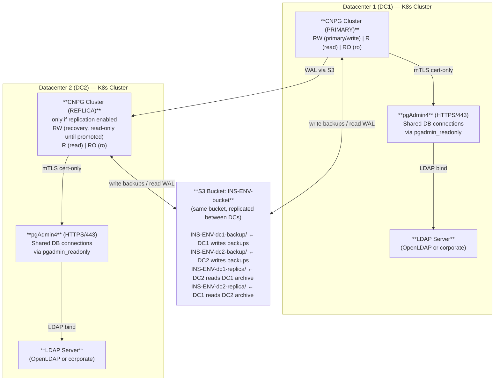

**Key points:**
- **Single S3 bucket** per client (e.g., `INS-ENV-bucket`), shared by both DCs — the DC name in the object path (`INS-ENV-dc1-backup/`, `INS-ENV-dc2-backup/`) prevents collisions
- Both primary and replica clusters have the **same symmetric architecture**: a designated primary + cascading standbys, with all three services (`-rw`, `-ro`, `-r`) created by the operator
- **RW** (read-write): points to the designated primary instance — accepts writes on the primary cluster; on the replica cluster, the designated primary is in continuous recovery mode (read-only) until promoted
- **R** (read): load-balanced across all instances (designated primary + standbys)
- **RO** (read-only): hot standby replicas only
- **pgAdmin** connects via mTLS using a shared `pgadmin_readonly` certificate (no password)
- **S3 backup**: every cluster writes its own backups to `INS-ENV-{DC}-backup/`; `externalClusters` entries reference the other DC's archive via `INS-ENV-{DC}-replica/`
- **Cross-DC replication** is WAL-based via S3 archive, not streaming replication over the network
- **Promotion**: disabling `replica.enabled` promotes the designated primary to a full read-write primary, making the replica cluster independent

## Multi-Datacenter Architecture

PGaaS deploys one independent Kubernetes cluster per datacenter. This is a deliberate choice over stretched/extended K8s clusters (which span multiple datacenters under a single control plane) — those require low-latency inter-DC networking, complex overlay configurations, and introduce a single etcd quorum as a cross-DC failure domain. Instead, each datacenter runs its own fully autonomous K8s cluster with its own control plane, etcd, CNPG operator, and cert-manager CA.

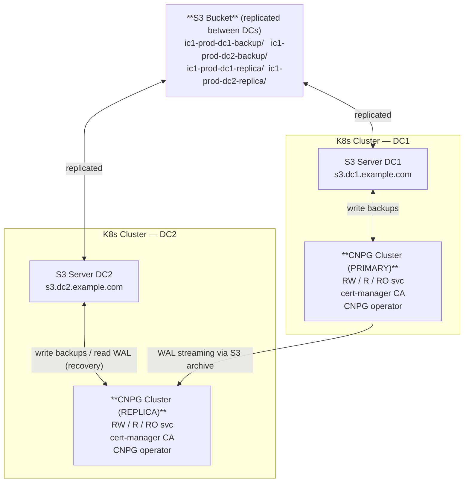

### One K8s cluster per datacenter

Each datacenter gets its own K8s cluster, its own CNPG operator installation, and its own cert-manager root CA. CNPG clusters within a datacenter benefit from local HA (multiple replicas within the same K8s cluster), while cross-DC resilience is achieved through S3-based WAL archiving and recovery.

This model requires no cross-DC Kubernetes networking. The only cross-DC dependency is the S3 bucket replication, which is handled at the storage infrastructure level outside of Kubernetes.

### Distributed replication via S3

CNPG does not replicate between datacenters using streaming replication over the network. Instead, it uses an **S3-based object store as the replication transport**:

1. The **primary cluster** (in DC1) continuously archives WAL segments and base backups to S3 via the Barman Cloud plugin.
2. The **replica cluster** (in DC2) bootstraps via `recovery` from the primary's S3 archive and continuously replays new WAL segments as they appear.
3. Both clusters write to the **same logical S3 bucket**, but the bucket is physically replicated between datacenters at the storage layer — each DC has its own S3 server endpoint serving the same replicated data.

This means the replica cluster in DC2 reads WAL from its **local** S3 endpoint (`s3.dc2.example.com`), not from DC1's S3 server. The S3 infrastructure handles cross-DC data synchronization transparently.

### S3 infrastructure: one server per DC, shared bucket

Each datacenter runs its own S3-compatible server. All servers serve the same replicated bucket:

| Component | DC1 | DC2 |
|-----------|-----|-----|
| S3 endpoint | `s3.dc1.example.com` | `s3.dc2.example.com` |
| Bucket | `ic1-prod-backups` (replicated) | `ic1-prod-backups` (replicated) |
| Written by | DC1's CNPG primary | DC2's CNPG replica |
| Replicated to | DC2 (via S3 infra) | DC1 (via S3 infra) |

Each CNPG cluster always talks to its **local** S3 endpoint. The cross-DC replication of S3 objects is infrastructure-level (e.g., MinIO site replication, Ceph multi-site, or cloud-native S3 cross-region replication) and is invisible to CNPG.

### Object path namespacing to avoid conflicts

Since both clusters write to the same bucket, object paths include the datacenter name to prevent overwrites:

```
s3://{bucket}/{INS}-{ENV}-{DC}-backup/     Primary backups (WAL + base backups)
s3://{bucket}/{INS}-{ENV}-{DC}-replica/    Replica restore source (externalClusters)
```

Example for client `ic1` in `prod`:

```
DC1 primary writes to:     s3://ic1-prod-backups/ic1-prod-dc1-backup/
DC2 replica reads from:    s3://ic1-prod-backups/ic1-prod-dc1-replica/
                           (externalClusters entry pointing to DC1's archive)

DC2 also writes to:        s3://ic1-prod-backups/ic1-prod-dc2-backup/
                           (its own local backups, used if DC2 is later promoted)
```

The `{DC}` segment in the path guarantees that a primary and replica in different datacenters never collide on the same S3 prefix, even though they share a bucket.

### CNPG Cluster CRD wiring

The replica cluster's `Cluster` CRD references the primary via an `externalClusters` entry. This entry provides the S3 archive coordinates for the primary's backup path:

```yaml
# Generated on the replica cluster (DC2)
spec:
  replica:
    enabled: true
    primary: prod-ic1-dc1           # external cluster name of the primary
  externalClusters:
    - name: prod-ic1-dc1
      barmanObjectStore:
        destinationPath: s3://ic1-prod-backups/ic1-prod-dc1-replica/
        endpointURL: https://s3.dc2.example.com    # local S3 endpoint
        s3Credentials: ...
  bootstrap:
    recovery:
      source: prod-ic1-dc1          # recover from primary's archive
```

The primary cluster has a symmetric `externalClusters` entry pointing to DC2's replica path — this is used during switchover when the primary needs to become a replica.

### Local multi-DC (minikube)

For local development, the same architecture is simulated with two minikube profiles (`cluster1`/`cluster2`). Since minikube clusters cannot share S3 infrastructure at the storage layer, a single SeaweedFS instance on `cluster1` serves as the S3 backend for both, accessed via NodePort from both clusters. The `kubeContext` field in `datacenters.yaml` enables scripts to target the correct minikube profile:

```yaml
# confs/admin/local/datacenters.yaml
datacenters:
  local1:
    kubeContext: cluster1       # minikube profile name = kubectl context
    s3:
      endpoint: "http://192.168.49.2:30333"   # cluster1 NodePort
  local2:
    kubeContext: cluster2
    s3:
      endpoint: "http://192.168.49.2:30333"   # same SeaweedFS, same endpoint
```

## DNS Transparency — Primary/Replica Switchover

Clients connect to DNS aliases that abstract away the physical primary location. When the primary switches datacenter, only the DNS record changes — clients reconnect without any configuration update.

### DNS Alias Model

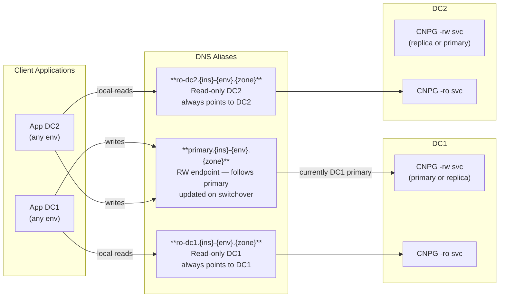

### Alias Semantics

| Alias | Points to | Changes on switchover? |
|-------|-----------|------------------------|
| `primary.{ins}-{env}.{zone}` | RW service of whichever DC holds the primary | **Yes** — updated by `promote-cluster.sh` |
| `ro-dc1.{ins}-{env}.{zone}` | DC1's RO service | No — static per DC |
| `ro-dc2.{ins}-{env}.{zone}` | DC2's RO service | No — static per DC |

### Configuration

DNS aliases are configured per environment in `datacenters.yaml`:

```yaml
# confs/admin/prod/datacenters.yaml
dns:
  zone: example.com
  primaryPrefix: primary    # primary.{ins}-{env}.example.com

datacenters:
  dc1:
    dnsSuffix: dc1.example.com
    dns:
      roPrefix: ro-dc1      # ro-dc1.{ins}-{env}.example.com
    s3:
      endpoint: https://s3.dc1.example.com
  dc2:
    dnsSuffix: dc2.example.com
    dns:
      roPrefix: ro-dc2
    s3:
      endpoint: https://s3.dc2.example.com
```

Generated values expose the computed FQDNs:

```yaml
dns:
  primaryFqdn: "primary.ic1-prod.example.com"
  roFqdn: "ro-dc1.ic1-prod.example.com"
  zone: "example.com"
```

### DNS Update on Switchover

`promote-cluster.sh` automatically updates the primary DNS alias after promotion. For local environments, it patches the CoreDNS ConfigMap. For production, hook the `scripts/update-dns.sh` to your DNS provider's API.

```bash
# After promote:
#   primary.ic1-prod.example.com → prod-ic1-dc2-rw.ic1-prod.dc2.example.com
make promote INS=ic1 ENV=prod DC=dc2 DEMOTION_TOKEN=<token>
```

## Directory Structure

```
pgaas/
├── README.md
├── Makefile                              # Single entry point for all operations
├── helmfile.yaml                         # Helmfile with label-based selectors
├── .gitignore
│
├── manifests/                            # Plain K8s manifests (not Helm charts)
│   ├── cert-manager-ca.yaml             # Root CA: SelfSignedIssuer + RootCA + ClusterIssuer
│   └── local-storage-class.yaml         # Local StorageClass for dev environments
│
├── confs/                                # All configuration (admin + user + generated)
│   ├── admin/                            # Admin (platform team) values - HIGH priority
│   │   ├── local/                        # Local development environment
│   │   │   ├── postgresql.yaml           # PG params, instances, storage profiles, ImageCatalog, monitoring
│   │   │   ├── clients.yaml              # Client registry: DCs, S3/LDAP creds, storage profile
│   │   │   ├── datacenters.yaml          # DC list with S3 endpoints + DNS suffix + DNS aliases
│   │   │   ├── backup.yaml               # Schedule, retention
│   │   │   ├── plugins.yaml              # Available CNPG plugins
│   │   │   ├── seaweedfs.yaml            # SeaweedFS S3 config (local only)
│   │   │   ├── openldap.yaml             # OpenLDAP config (local only)
│   │   │   └── observability.yaml        # Prometheus/Grafana/OTel settings (local only)
│   │   ├── hp/                           # HP environment (sub-envs: dev1, dev2, pic...)
│   │   │   ├── ldap.yaml                 # LDAP server config (per-env)
│   │   │   └── ...
│   │   ├── perf/                         # Performance testing
│   │   ├── pprod/                        # Pre-production
│   │   └── prod/                         # Production
│   │
│   ├── users/                            # User (client) values - LOW priority
│   │   ├── ic1/                         # INS=ic1
│   │   │   ├── local/
│   │   │   │   └── databases.yaml
│   │   │   └── hp/
│   │   │       ├── dev1/databases.yaml   # Sub-env specific
│   │   │       └── dev2/databases.yaml
│   │   └── is1/                       # INS=is1
│   │       └── hp/
│   │           ├── pic/databases.yaml
│   │           └── staging/databases.yaml
│   │
│   └── _generated/                       # Gitignored output of generate-values.sh
│       ├── {INS}-{ENV}/values.yaml       # Merged cluster values
│       └── local-infra/                  # Local infrastructure values
│           ├── seaweedfs-values.yaml
│           ├── openldap-values.yaml
│           └── observability-values.yaml # Generated from observability.yaml + clients list
│
├── core/                                 # Main Helm chart
│   ├── Chart.yaml                        # Dependencies: pgadmin4 subchart
│   ├── values.yaml                       # Structural defaults
│   ├── values.schema.json                # JSON Schema for generated values validation
│   ├── charts/pgadmin4/                  # pgAdmin4 subchart (LDAP + mTLS)
│   └── templates/
│       ├── _helpers.tpl                  # Naming, labels helpers
│       ├── cluster.yaml                  # CNPG Cluster CRD
│       ├── imagecatalog.yaml             # CNPG ImageCatalog CRD
│       ├── objectstore.yaml              # Barman ObjectStore CRD
│       ├── scheduled-backup.yaml         # ScheduledBackup CRD
│       ├── databases.yaml                # Database CRDs (loop, skip bootstrap DB)
│       ├── certificates.yaml             # Server + client TLS certs (signed by root CA)
│       ├── monitoring-queries-cm.yaml    # Custom Prometheus queries injected into CNPG exporter
│       ├── dnsendpoint.yaml              # ExternalDNS DNSEndpoint CRD (RO alias per DC)
│       ├── s3-credentials-secret.yaml    # S3 credentials secret (local env only)
│       ├── networkpolicy.yaml            # NetworkPolicy for namespace isolation
│       └── rbac.yaml                     # RBAC Role + RoleBindings
│
├── local-infra/                          # Local infrastructure charts
│   ├── seaweedfs/                        # Local S3 for Barman backups
│   ├── openldap/                         # Local LDAP for pgAdmin4
│   └── observability/                    # Prometheus + OTel Collector + Grafana
│       ├── Chart.yaml
│       ├── values.yaml
│       └── templates/
│           ├── prometheus.yaml           # StatefulSet + PVC + Service (remote_write receiver)
│           ├── otel-collector.yaml       # ClusterRole + ConfigMap + Deployment + Service
│           ├── grafana.yaml              # Deployment + NodePort Service (+ optional Ingress)
│           ├── grafana-provisioning-cm.yaml        # Prometheus datasource + folder providers
│           ├── grafana-dashboards-admin.yaml        # "PGaaS Admin" folder dashboard
│           └── grafana-dashboards-clients.yaml      # Per-client folder dashboards (range loop)
│
└── scripts/                              # All operational scripts
    ├── lib/                              # Shared shell libraries
    │   ├── common.sh                     # Env resolution, validation, computed names
    │   └── merge.sh                      # yq-based deep merge utilities
    ├── generate-values.sh
    ├── create-cluster.sh
    ├── delete-cluster.sh
    ├── status-cluster.sh
    ├── promote-cluster.sh
    ├── demote-cluster.sh
    ├── upgrade-cluster.sh                # Rolling image upgrade
    ├── update-dns.sh                     # DNS alias update (primary alias on switchover)
    ├── test-local-infra.sh               # Test SeaweedFS + OpenLDAP connectivity
    ├── install-local-infra.sh
    └── delete-local-infra.sh
```

## Storage Profiles

Admin defines pre-configured storage tiers (S/M/L/XXL) in each environment's `postgresql.yaml`. Each tier bundles storage size and resource limits.

### Profile Definition (postgresql.yaml)

```yaml
storageProfiles:
  S:
    storage:
      size: 5Gi
    resources:
      requests: { memory: 256Mi, cpu: 100m }
      limits: { memory: 512Mi, cpu: 500m }
  M:
    storage:
      size: 10Gi
    resources:
      requests: { memory: 512Mi, cpu: 250m }
      limits: { memory: 1Gi, cpu: "1" }
  L:
    storage:
      size: 20Gi
    resources:
      requests: { memory: 1Gi, cpu: "1" }
      limits: { memory: 2Gi, cpu: "2" }
  XXL:
    storage:
      size: 50Gi
    resources:
      requests: { memory: 2Gi, cpu: "2" }
      limits: { memory: 4Gi, cpu: "4" }
```

### Per-Client Assignment (clients.yaml)

```yaml
clients:
  ic1:
    storageProfile: M
    datacenters: [dc1]
    s3Bucket: ic1-backups
    s3Credentials:
      secretName: ic1-s3-credentials    # Vault-synced K8s secret
```

During value generation, the profile is resolved to concrete `postgresql.storage.size` and `postgresql.resources` values. The `storageClass` stays at the environment level in `postgresql.yaml`.

## S3 Credentials Model

Each client has its own S3 bucket and credentials. The credential model depends on the environment:

### Local Environment (inline strings)

```yaml
# confs/admin/local/clients.yaml
clients:
  ic1:
    s3Bucket: ic1-backups
    s3Credentials:
      accessKey: admin           # Inline access key
      secretKey: admin123        # Inline secret key
```

The chart creates a K8s Secret with these inline values automatically.

### Real Environments (Vault-synced secret)

```yaml
# confs/admin/prod/clients.yaml
clients:
  ic1:
    s3Bucket: ic1-prod-backups
    s3Credentials:
      secretName: ic1-s3-credentials   # Pre-existing K8s secret (synced from HashiCorp Vault)
```

The secret must exist in the namespace with `accessKey` and `secretKey` keys. No Secret resource is created by the chart — the Vault operator or external-secrets-operator populates it.

## Datacenter Model

Deployments target a specific datacenter (DC). The DC determines the S3 endpoint URL used for backups and replication (S3 buckets are replicated between DCs).

### DC as Deployment Input

```bash
make create INS=ic1 ENV=prod DC=dc1   # Deploy to dc1
make create INS=ic1 ENV=prod DC=dc2   # Deploy to dc2
```

If `DC` is omitted, the first datacenter in the client's list is used.

### S3 Destination Paths

Paths include the datacenter name to avoid conflicts:

```
s3://{bucket}/{INS}-{ENV}-{DC}-backup/     # Backup path
s3://{bucket}/{INS}-{ENV}-{DC}-replica/    # Replication path (external clusters)
```

Example for `ic1` in `prod` deployed to `dc1`:
```
s3://ic1-prod-backups/ic1-prod-dc1-backup/
```

### S3 Endpoint Resolution

The S3 endpoint URL comes from the **current datacenter** (the one being deployed to), not the primary DC. This is because S3 buckets are replicated between datacenters — each DC has its own S3 endpoint for the same replicated bucket.

```yaml
# confs/admin/prod/datacenters.yaml
dns:
  zone: example.com
  primaryPrefix: primary

datacenters:
  dc1:
    dnsSuffix: dc1.example.com
    dns:
      roPrefix: ro-dc1
    s3:
      endpoint: https://s3.dc1.example.com   # Used when DC=dc1
      region: eu-west-1
  dc2:
    dnsSuffix: dc2.example.com
    dns:
      roPrefix: ro-dc2
    s3:
      endpoint: https://s3.dc2.example.com   # Used when DC=dc2
      region: eu-central-1
```

## Values Merging Strategy

### Priority Model

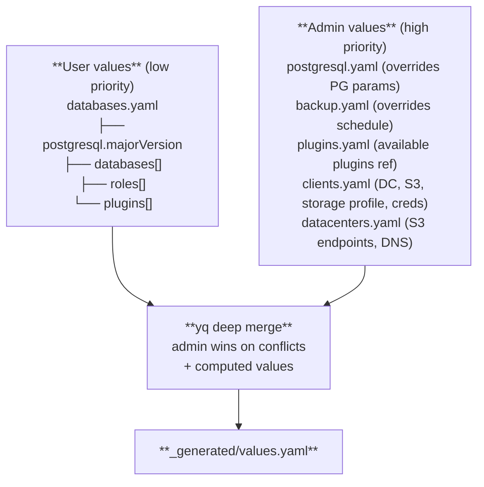

**Merge tool:** `yq eval-all 'select(fileIndex == 0) * select(fileIndex == 1)'` (deep merge, second file wins)

**Example:** Admin sets `max_connections: 200`, user sets `max_connections: 300` → generated has `200` (admin wins).

### Environment Resolution

| ENV input | Admin dir | User dir | Notes |
|-----------|-----------|----------|-------|
| `local` | `confs/admin/local/` | `confs/users/{INS}/local/` | Fixed env |
| `perf` | `confs/admin/perf/` | `confs/users/{INS}/perf/` | Fixed env |
| `pprod` | `confs/admin/pprod/` | `confs/users/{INS}/pprod/` | Fixed env |
| `prod` | `confs/admin/prod/` | `confs/users/{INS}/prod/` | Fixed env |
| `dev1` | `confs/admin/hp/` | `confs/users/{INS}/hp/dev1/` | HP sub-env |
| `pic` | `confs/admin/hp/` | `confs/users/{INS}/hp/pic/` | HP sub-env |
| `staging` | `confs/admin/hp/` | `confs/users/{INS}/hp/staging/` | HP sub-env |

Any ENV that is not `local`, `perf`, `pprod`, or `prod` is treated as an HP sub-environment.

### Generation Flow

```
generate-values.sh <INS> <ENV> [DC]
│
├─ 1.  Load user databases.yaml as base
├─ 1b. Validate: reject disallowed keys (only postgresql, plugins, databases, roles allowed)
├─ 2.  Deep-merge admin postgresql.yaml on top (admin wins)
├─ 3.  Deep-merge admin backup.yaml on top
├─ 4.  Extract client config from admin clients.yaml
├─ 4b. Resolve storage profile → storage.size + resources
├─ 5.  Lookup current DC S3 endpoint + DNS suffix from datacenters.yaml
├─ 5b. Resolve per-client S3 credentials (inline or Vault secret ref)
├─ 5c. Compute DNS aliases (primaryFqdn, roFqdn) from datacenters.yaml dns config
├─ 6.  Compute: clusterName, namespace, S3 destination paths (INS-ENV-DC-backup)
├─ 7.  Merge all into final values
├─ 8.  Add pgAdmin4 config: mTLS connection, LDAP (all envs), TLS dnsNames
├─ 9.  Add NetworkPolicy config (from clients.yaml, disabled for local)
├─ 9b. Add RBAC config (self-service hp/perf, admin-only pprod/prod, disabled for local)
├─ 10. Write confs/_generated/{INS}-{ENV}/values.yaml
│
└─ (local env only)
   ├─ 11. Generate confs/_generated/local-infra/seaweedfs-values.yaml
   ├─ 12. Generate confs/_generated/local-infra/openldap-values.yaml
   │       (auto-generates one LDAP user per client: cn=INS, uid=INS, mail=mail@INS.local)
   └─ 13. Generate confs/_generated/local-infra/observability-values.yaml
           (merges observability.yaml settings + clients list for Grafana folder provisioning)
```

## CNPG ImageCatalog

PostgreSQL versions are centrally managed by the admin via the `imageCatalog` in `postgresql.yaml`. Users select which major version to use.

### Admin Configuration (postgresql.yaml)

```yaml
imageCatalog:
  name: pgaas-images
  images:
    - major: 16
      image: ghcr.io/cloudnative-pg/postgresql:16.4-bookworm
    - major: 15
      image: ghcr.io/cloudnative-pg/postgresql:15.8-bookworm
```

### User Selection (databases.yaml)

```yaml
postgresql:
  majorVersion: 16   # References admin catalog
```

### Rendered CRDs

The chart renders a namespace-scoped `ImageCatalog` and the `Cluster` references it:

```yaml
# ImageCatalog
apiVersion: postgresql.cnpg.io/v1
kind: ImageCatalog
metadata:
  name: pgaas-images
spec:
  images:
    - major: 16
      image: ghcr.io/cloudnative-pg/postgresql:16.4-bookworm

# Cluster references it
spec:
  imageCatalogRef:
    apiGroup: postgresql.cnpg.io
    kind: ImageCatalog
    name: pgaas-images
    major: 16
```

## CNPG Plugins

Admin declares available plugins per environment. Users select which to enable.

### Admin (plugins.yaml)

```yaml
availablePlugins:
  - name: barman-cloud.cloudnative-pg.io
    description: Barman Cloud backup via S3-compatible storage
```

### User (databases.yaml)

```yaml
plugins:
  - name: barman-cloud.cloudnative-pg.io
```

Plugins are rendered directly in the Cluster CRD `spec.plugins[]`. The barman-cloud plugin automatically gets its `barmanObjectName` parameter set.

## Declarative Role Management

Users define database roles following the [CNPG declarative role management](https://cloudnative-pg.io/docs/devel/declarative_role_management) model. All roles use **cert-only authentication** — no passwords are configured.

### User Configuration (databases.yaml)

```yaml
databases:
  - name: app_db
    owner: app_user
    cnPattern: "app_user.ic1.dev1"      # Certificate CN for this owner

roles:
  - name: app_user
    ensure: present
    login: true
    superuser: false
    createdb: false
    inherit: true

  - name: report_user
    ensure: present
    login: true
    inRoles:
      - pg_read_all_data
```

The `cnPattern` in databases defines the certificate common name (CN) for each owner. The CN is used for pg_hba/pg_ident authentication mapping.

### Role Properties

| Property | Type | Default | Description |
|----------|------|---------|-------------|
| `name` | string | required | Role name |
| `ensure` | string | `present` | `present` or `absent` |
| `login` | bool | `true` | Can log in |
| `superuser` | bool | `false` | Superuser privileges |
| `createdb` | bool | `false` | Can create databases |
| `inherit` | bool | `true` | Inherits parent role privileges |
| `connectionLimit` | int | - | Max concurrent connections |
| `inRoles` | list | `[]` | Parent roles to inherit from |
| `databases` | list | `[]` | Databases this role can access (generates pg_hba rules + client cert) |

### pgAdmin Read-Only User

The admin automatically injects a `pgadmin_readonly` user into every cluster with `pg_read_all_data` membership and **cert-only authentication** (no password). This allows pgAdmin to read all resources across all databases.

```yaml
# Admin postgresql.yaml
pgadminUser:
  name: pgadmin_readonly
  roles:
    - pg_read_all_data
```

This role is rendered in `spec.managed.roles` of the Cluster CRD alongside user-defined roles.

## Access Control (pg_hba + pg_ident)

Database access is restricted on a per-database basis using TLS client certificate authentication with ident mapping.

### pg_hba Rules

Database owners get implicit access to their database. Non-owner roles with `databases` get explicit access. The pgAdmin user gets access to all databases:

```
# Owner access (implicit from databases[].owner)
hostssl app_db       app_user         all cert map=pgaas
hostssl reporting_db report_user      all cert map=pgaas
# Non-owner access (explicit from roles[].databases)
hostssl app_db       app_readonly     all cert map=pgaas
hostssl reporting_db app_readonly     all cert map=pgaas
# pgAdmin read-only (all databases)
hostssl all          pgadmin_readonly all cert map=pgaas
local   all          all              peer                  # internal CNPG operations
```

### pg_ident Mapping

The `pgaas` ident map provides 1:1 mapping from certificate CN to PostgreSQL role:

```
pgaas app_user         app_user
pgaas report_user      report_user
pgaas app_readonly     app_readonly
pgaas pgadmin_readonly pgadmin_readonly
```

This ensures the certificate CN must exactly match the PostgreSQL role name. Client TLS certificates are automatically generated for all database owners and roles with explicit `.databases` access.

## TLS Certificate Chain

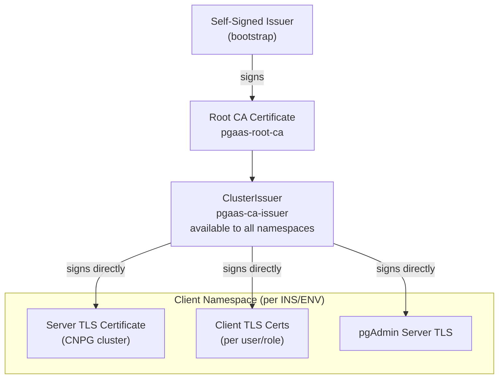

The root CA is deployed as a plain K8s manifest (`manifests/cert-manager-ca.yaml`). It creates:
1. A **self-signed bootstrap** ClusterIssuer
2. A **root CA certificate** (10-year validity, ECDSA P-256)
3. A **ClusterIssuer** (`pgaas-ca-issuer`) backed by the root CA

Each client namespace then gets leaf certificates signed directly by the root CA ClusterIssuer:
1. A **server TLS** certificate for the CNPG cluster endpoints (RW/R/RO services + DC domain SANs)
2. **Client TLS** certificates for each database owner, roles with explicit database access, and the pgAdmin readonly user
3. A **pgAdmin server TLS** certificate for HTTPS (managed by the pgAdmin subchart)

## Databases Schema

The user `databases.yaml` file is validated during generation. Only the following top-level keys are allowed: **`postgresql`**, **`plugins`**, **`databases`**, **`roles`**. Any admin-level key (`backup`, `imageCatalog`, `s3`, `replication`, `pgadminUser`, etc.) will cause an error.

```yaml
# User databases.yaml - full schema (allowed keys only)
postgresql:
  majorVersion: 16

plugins:
  - name: barman-cloud.cloudnative-pg.io

databases:
  - name: app_db
    owner: app_user
    cnPattern: "app_user.ic1.dev1"
  - name: reporting_db
    owner: report_user
    cnPattern: "report_user.ic1.dev1"

# Cert-only auth: CN in client certificate maps to role name via pg_ident
roles:
  - name: app_user
    ensure: present
    login: true
    superuser: false
    createdb: false
    inherit: true
  - name: report_user
    ensure: present
    login: true
    inRoles:
      - pg_read_all_data
  - name: app_readonly           # Non-owner role with explicit database access
    ensure: present
    login: true
    inRoles:
      - pg_read_all_data
    databases:                    # Grants pg_hba access to these databases
      - app_db
      - reporting_db
```

## Admin Values Schema

### postgresql.yaml

```yaml
postgresql:
  instances: 2
  storage:
    storageClass: ceph-rbd
  parameters:
    max_connections: "200"
    shared_buffers: 256MB

storageProfiles:
  S:
    storage: { size: 5Gi }
    resources:
      requests: { memory: 256Mi, cpu: 100m }
      limits: { memory: 512Mi, cpu: 500m }
  M:
    storage: { size: 10Gi }
    resources:
      requests: { memory: 512Mi, cpu: 250m }
      limits: { memory: 1Gi, cpu: "1" }
  # ... L, XXL

imageCatalog:
  name: pgaas-images
  images:
    - major: 16
      image: ghcr.io/cloudnative-pg/postgresql:16.4-bookworm

pgadminUser:
  name: pgadmin_readonly
  roles:
    - pg_read_all_data

# Monitoring — CNPG built-in Prometheus exporter on :9187
monitoring:
  enabled: true
  tls: false              # false = HTTP (local); true = HTTPS (prod)
  customQueries: true
  disableDefaultQueries: false
```

### clients.yaml

```yaml
clients:
  ic1:
    datacenters: [dc1, dc2]
    primaryDatacenter: dc1           # Explicit primary DC for replication
    s3Bucket: ic1-prod-backups
    storageProfile: XXL
    s3Credentials:
      secretName: ic1-s3-credentials  # Vault-synced K8s secret (real envs)
    ldapCredentials:
      bindDn: "cn=pgadmin-ic1,ou=services,dc=example,dc=com"
      bindPasswordSecret: ic1-ldap-bind-password  # Vault-synced K8s secret
    replication:
      enabled: true
    networkPolicy:
      allowedNamespaces:
        - monitoring
      allowedCIDRs:
        - "10.0.0.0/8"
```

For local env, inline credentials:

```yaml
clients:
  ic1:
    datacenters: [local]
    s3Bucket: ic1-backups
    storageProfile: S
    s3Credentials:
      accessKey: admin               # Inline (local env only)
      secretKey: admin123
    ldapCredentials:
      bindDn: "cn=admin,dc=pgaas,dc=local"
      bindPassword: admin            # Inline (local env only)
    replication:
      enabled: false
```

### datacenters.yaml

```yaml
# Global DNS config (shared across DCs)
dns:
  zone: example.com
  primaryPrefix: primary    # builds: primary.{ins}-{env}.example.com

datacenters:
  dc1:
    dnsSuffix: dc1.example.com
    dns:
      roPrefix: ro-dc1      # builds: ro-dc1.{ins}-{env}.example.com
    s3:
      endpoint: https://s3.dc1.example.com
      region: eu-west-1
  dc2:
    dnsSuffix: dc2.example.com
    dns:
      roPrefix: ro-dc2
    s3:
      endpoint: https://s3.dc2.example.com
      region: eu-central-1
```

The `dnsSuffix` is used to build the CNPG service FQDN for external access:
`{clusterName}-rw.{namespace}.{dnsSuffix}` (e.g., `dev1-ic1-rw.ic1-dev1.dc1.example.com`).

The `dns` block drives DNS alias computation in `generate-values.sh` and DNS record updates in `promote-cluster.sh`.

S3 credentials are **not** in datacenters.yaml — they are per-client in `clients.yaml`.

### backup.yaml

```yaml
backup:
  schedule: "0 0 1 * * *"
  retentionPolicy: "14d"
  target: prefer-standby
```

### observability.yaml (local env only)

```yaml
observability:
  prometheus:
    retention: 15d
    storage:
      size: 10Gi
      storageClass: standard

  grafana:
    adminPassword: admin
    ingress:
      enabled: false
      host: ""

  otelCollector:
    scrape:
      interval: 30s
      tls: false
    operatorEndpoint: "http://cnpg-controller-manager-metrics-service.cnpg-system.svc.cluster.local:8080"
    operatorTls: false
```

### seaweedfs.yaml (local env only)

```yaml
seaweedfs:
  s3:
    accessKey: admin
    secretKey: admin123
    port: 8333
  service:
    name: seaweedfs-s3
    namespace: local-infra
  storage:
    size: 10Gi
```

### openldap.yaml (local env only)

```yaml
openldap:
  organization: PGaaS
  domain: pgaas.local
  baseDn: dc=pgaas,dc=local
  adminPassword: admin
  configPassword: config
  service:
    name: openldap-openldap
    namespace: local-infra
    port: 389
```

## pgAdmin4

pgAdmin connects to CNPG clusters via mutual TLS (mTLS) with shared database connections. The pgAdmin UI is served over HTTPS with a TLS certificate managed by the pgAdmin subchart.

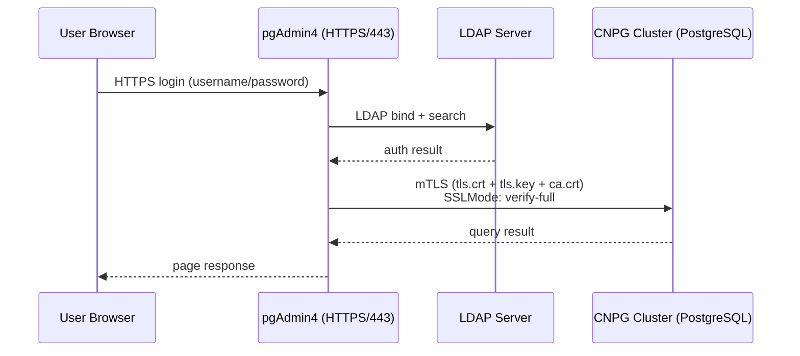

- pgAdmin is served over **HTTPS** (port 443) with a cert-manager TLS certificate managed by the subchart
- Users authenticate to pgAdmin via **LDAP** (all environments)
- pgAdmin uses a **shared `pgadmin_readonly` user** with TLS client cert for all DB connections (cert-only, no password)
- Connection mode: `SSLMode: verify-full` with client cert at `/pgadmin4/tls/`
- Per-database access: `pgadmin_readonly` is the only role allowed to connect to all databases (via pg_hba)

### pgAdmin Default Password

For **local env**, the subchart creates a Secret with a default "changeme" password (`defaultPasswordCreate: true`). For **real envs**, the password secret must be pre-created (e.g., synced from Vault) and `defaultPasswordCreate` is set to `false`.

### LDAP Authentication Model

LDAP authentication uses a two-layer configuration:

- **LDAP server** — environment-level, shared by all clients in that env
  - **Local:** derived from `openldap.yaml` (OpenLDAP in local-infra namespace)
  - **Real envs:** configured in `ldap.yaml` (e.g., corporate LDAP/AD server)
- **Bind credentials** — per-client, different `bindDn` + password per client
  - **Local:** inline `bindPassword` in `clients.yaml` (chart creates the K8s Secret)
  - **Real envs:** `bindPasswordSecret` in `clients.yaml` (Vault-synced K8s Secret)

### ldap.yaml (real environments only)

```yaml
ldap:
  serverUri: ldaps://ldap.example.com:636
  baseDn: ou=people,dc=example,dc=com
  searchFilter: "(uid={login})"
```

### Local LDAP Users

For local development, one LDAP user is auto-generated per client during value generation. No `ldap-users.yaml` file is needed:

| Field | Value |
|-------|-------|
| `cn` / `uid` | `{INS}` (e.g., `ic1`) |
| `sn` | `{INS}` |
| `password` | `{INS}` |
| `mail` | `mail@{INS}.local` |

### Local Environment Wiring

```
pgAdmin4      ──── LDAP ────► OpenLDAP      (local-infra namespace, port 389)
pgAdmin4      ──── mTLS ────► CNPG Cluster  (client namespace, port 5432)
CNPG          ──── S3   ────► SeaweedFS     (local-infra namespace, port 8333)
OTel Collector ─── scrape ──► CNPG :9187   (k8s_sd, all client namespaces)
OTel Collector ─── scrape ──► CNPG operator :8080 (cnpg-system namespace)
OTel Collector ─── remote_write ──► Prometheus (local-infra namespace, port 9090)
Grafana       ──── datasource ──► Prometheus (local-infra namespace)
```

## Observability

PGaaS ships a full local observability stack. It uses the **CNPG built-in Prometheus exporter** (no sidecars) and routes metrics through an OpenTelemetry Collector to Prometheus, visualised in Grafana.

### Architecture

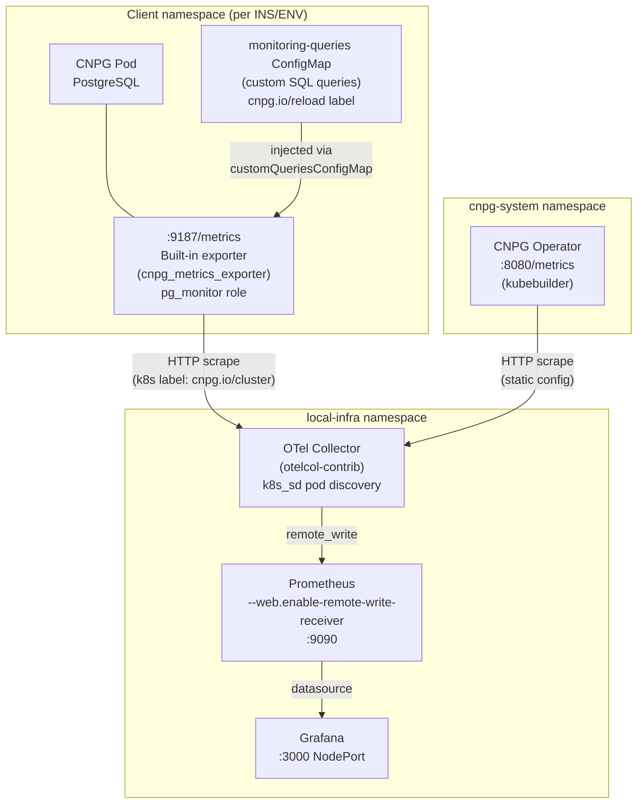

**Key design choices:**
- CNPG's built-in exporter already runs `pg_monitor`-level queries internally — no extra user or sidecar needed
- `monitoring.tls: false` for local (plain HTTP on `:9187`); set to `true` for prod (HTTPS, OTel uses `insecureSkipVerify`)
- OTel Collector holds a `ClusterRole` to discover CNPG pods across all namespaces via `kubernetes_sd`
- Operator metrics cover reconcile errors, duration (p95), and queue depth
- Deployed once on the first DC (shared, like SeaweedFS)

### Metrics

**Built-in (from CNPG default `cnpg-default-monitoring` ConfigMap):**

| Metric | Description |
|--------|-------------|
| `cnpg_collector_up` | Instance health (1=up) |
| `cnpg_pg_stat_database_numbackends` | Active connections per database |
| `cnpg_pg_stat_database_xact_commit_total` | Committed transactions |
| `cnpg_pg_stat_database_blks_hit_total` / `blks_read_total` | Cache hits/misses |
| `cnpg_pg_stat_database_deadlocks_total` | Deadlocks per database |
| `cnpg_pg_archive_command_status_failed_count` | WAL archive failures |
| `cnpg_pg_wal_files_total` | WAL file count |
| `cnpg_pg_replication_lag_seconds` | Replication lag (seconds) |
| `cnpg_pg_stat_bgwriter_*` | Checkpoint and background writer stats |
| `controller_runtime_reconcile_*` | Operator reconcile rate, errors, duration |

**Custom (from per-cluster `{clusterName}-monitoring-queries` ConfigMap):**

| Metric prefix | Description |
|---------------|-------------|
| `cnpg_pg_database_size_size_bytes` | Per-database size in bytes |
| `cnpg_pg_activity_count` | Connection count by database + state |
| `cnpg_pg_activity_max_query_duration_seconds` | Longest running query per state |
| `cnpg_pg_stat_user_tables_n_dead_tup` | Dead tuples per table (vacuum health) |
| `cnpg_pg_stat_user_tables_seconds_since_autovacuum` | Time since last autovacuum |
| `cnpg_pg_replication_lag_seconds` | Replication lag (also in default set) |
| `cnpg_pg_replication_slots_detail_active` | Replication slot active status |
| `cnpg_pg_replication_slots_detail_flush_lag_bytes` | Logical slot consumer lag |
| `cnpg_pg_temp_files_temp_bytes` | Temp file bytes written per database |

The custom ConfigMap carries `cnpg.io/reload: ""` — the CNPG operator picks up changes without a rolling restart.

### Labels (added by OTel Collector relabeling)

| Label | Source | Example |
|-------|--------|---------|
| `cluster` | `cnpg.io/cluster` pod label | `local-ic1` |
| `ins` | `pgaas.io/ins` pod label | `ic1` |
| `env` | `pgaas.io/env` pod label | `local` |
| `role` | `cnpg.io/instanceRole` pod label | `primary` / `replica` |
| `namespace` | Pod namespace | `ic1-local` |
| `pod` | Pod name | `local-ic1-1` |

### Grafana Dashboards

Two sets of dashboards are automatically provisioned:

**PGaaS Admin folder** — all clusters:

| Panel | Query |
|-------|-------|
| Instances Up / Down | `cnpg_collector_up` count |
| Total active connections | Sum of `numbackends` |
| WAL archive failures | `archive_command_status_failed_count` |
| Max replication lag | Max `pg_replication_lag_seconds` |
| Operator reconcile errors | `controller_runtime_reconcile_errors_total` |
| Active connections per cluster (time series) | `numbackends` by cluster |
| Transaction rate / TPS (time series) | `xact_commit + xact_rollback` rate |
| Replication lag per instance (time series) | `pg_replication_lag_seconds` |
| WAL files per cluster (time series) | `pg_wal_files_total` |
| Database sizes (bar gauge) | `pg_database_size_size_bytes` |
| Cache hit ratio per cluster (time series) | `blks_hit / (blks_hit + blks_read)` |
| Operator reconcile duration p95 | `controller_runtime_reconcile_time_seconds` histogram |
| Dead tuples top-10 tables | `pg_stat_user_tables_n_dead_tup` topk |

**Per-client folders (`{ins}`)** — filtered by `ins` label, one dashboard per client:

| Panel | Query |
|-------|-------|
| Active connections / Cache ratio / TPS / Deadlocks / Replication lag / Temp files | Stat panels |
| Active connections by database (time series) | `numbackends{ins="..."}` |
| Transaction rate by database (time series) | `xact_commit + xact_rollback` rate |
| Cache hit ratio by database (time series) | `blks_hit / (blks_hit + blks_read)` |
| Replication lag over time (time series) | `pg_replication_lag_seconds{ins="..."}` |
| Database sizes (bar gauge) | `pg_database_size_size_bytes{ins="..."}` |
| Connections by state (time series) | `pg_activity_count` by state |
| Dead tuples top-10 tables | `pg_stat_user_tables_n_dead_tup{ins="..."}` topk |
| Max query duration by state (time series) | `pg_activity_max_query_duration_seconds` |

Grafana folder provisioning is driven by the `clients:` list in `observability-values.yaml` (generated from `clients.yaml` during `generate-values.sh`). Adding a new client automatically creates a new Grafana folder on the next `infra-install` or Helm upgrade.

### Configuration

**Enable monitoring per environment** (`confs/admin/{env}/postgresql.yaml`):

```yaml
monitoring:
  enabled: true
  tls: false              # false = HTTP :9187 (local); true = HTTPS (prod, OTel uses insecureSkipVerify)
  customQueries: true     # inject {clusterName}-monitoring-queries ConfigMap
  disableDefaultQueries: false   # keep cnpg-default-monitoring queries
```

**Observability stack settings** (`confs/admin/local/observability.yaml`):

```yaml
observability:
  prometheus:
    retention: 15d
    storage:
      size: 10Gi
      storageClass: standard

  grafana:
    adminPassword: admin      # change for production
    ingress:
      enabled: false
      host: ""

  otelCollector:
    scrape:
      interval: 30s
      tls: false              # matches monitoring.tls above
    operatorEndpoint: "http://cnpg-controller-manager-metrics-service.cnpg-system.svc.cluster.local:8080"
    operatorTls: false        # operator metrics default to HTTP
```

### TLS on the metrics endpoint (production)

When `monitoring.tls: true`, CNPG serves metrics over HTTPS using the same server certificate as PostgreSQL. Because that certificate's SANs contain service names (e.g., `local-ic1-rw`) rather than pod IPs, the OTel Collector must use `insecure_skip_verify: true` for pod-level scraping. Set both flags consistently:

```yaml
# confs/admin/{env}/postgresql.yaml
monitoring:
  tls: true

# confs/admin/{env}/observability.yaml
observability:
  otelCollector:
    scrape:
      tls: true     # enables HTTPS scheme + insecure_skip_verify in OTel config
```

For the operator metrics, enable TLS by setting `METRICS_CERT_DIR` in the operator pod and setting `operatorTls: true`.

## NetworkPolicy — Namespace Isolation

Each CNPG cluster is protected by a Kubernetes NetworkPolicy that restricts which pods can connect to the database.

### Model

- **Same namespace**: always allowed (client apps + pgAdmin in the same namespace)
- **Admin-specified namespaces**: e.g., `monitoring` namespace for Prometheus scraping
- **Admin-specified CIDRs**: e.g., `10.0.0.0/8` for VPN/office access
- **Local env**: NetworkPolicy disabled (not needed for dev)

### Configuration (clients.yaml)

```yaml
clients:
  ic1:
    networkPolicy:
      allowedNamespaces:
        - monitoring
      allowedCIDRs:
        - "10.0.0.0/8"
```

If `networkPolicy` is not set in `clients.yaml`, defaults apply (same-namespace only).

### Environment Behavior

| Environment | NetworkPolicy | Notes |
|-------------|--------------|-------|
| local | Disabled | Dev environment, no isolation needed |
| hp/perf/pprod/prod | Enabled | Restricts ingress to same namespace + admin-configured exceptions |

## RBAC — Self-Service vs Admin-Only

Kubernetes RBAC controls who can deploy and manage CNPG clusters in each namespace.

### Model

- **HP/perf** (`teamEnv` = `hp` or `perf`): client team group gets a Role + RoleBinding → self-service deployment
- **pprod/prod** (`teamEnv` = `pprod` or `prod`): admin group only → deployments by admins
- **local**: no RBAC (dev environment)

### Generated RBAC Resources

| Resource | Purpose |
|----------|---------|
| `Role: pgaas-cluster-manager` | Grants manage access to CNPG CRDs + read access to core resources |
| `RoleBinding: pgaas-admin-binding` | Binds `pgaas-admins` group (always present, non-local) |
| `RoleBinding: pgaas-client-binding` | Binds `pgaas-{INS}` group (hp/perf only, enables self-service) |

### Environment Behavior

| Environment | Admin binding | Client binding | Client group |
|-------------|--------------|----------------|--------------|
| local | None | None | N/A |
| hp | `pgaas-admins` | `pgaas-{INS}` | Self-service |
| perf | `pgaas-admins` | `pgaas-{INS}` | Self-service |
| pprod | `pgaas-admins` | None | Admin-only |
| prod | `pgaas-admins` | None | Admin-only |

## Operations

### Makefile Targets

```bash
# Cluster operations (require INS and ENV, optional DC)
make generate   INS=ic1 ENV=prod DC=dc1   # Generate merged values
make create     INS=ic1 ENV=prod DC=dc1   # Generate + deploy cluster
make delete     INS=ic1 ENV=dev1           # Destroy cluster (confirmation)
make status     INS=ic1 ENV=dev1           # Show cluster status
make promote    INS=ic1 ENV=prod DEMOTION_TOKEN=<token>  # Graceful promote
make promote    INS=ic1 ENV=prod           # DR force promote (no token)
make demote     INS=ic1 ENV=dev1 NEW_PRIMARY=dev1-is1
make upgrade    INS=ic1 ENV=prod DC=dc1   # Rolling image upgrade

# Local infrastructure
make infra-install    # Deploy storage class + cert-manager CA + SeaweedFS + OpenLDAP + Observability
make infra-delete     # Destroy local infrastructure
make infra-test       # Test SeaweedFS + OpenLDAP connectivity

# Development
make check-tools                        # Check required CLI tools
make template        INS=ic1 ENV=dev1  # Helm template dry-run
make template-infra  INS=ic1           # Template local-infra
make preview         INS=ic1 ENV=local # Generate + validate values
make clean                              # Remove _generated/
```

### Workflow: New Client Setup

```bash
# 1. Register client in admin values
#    Edit confs/admin/{env}/clients.yaml with storageProfile, s3Bucket, s3Credentials, ldapCredentials

# 2. Create user values
mkdir -p confs/users/newclient/hp/dev1
cat > confs/users/newclient/hp/dev1/databases.yaml <<EOF
postgresql:
  majorVersion: 16
plugins:
  - name: barman-cloud.cloudnative-pg.io
databases:
  - name: myapp_db
    owner: myapp_user
    cnPattern: "myapp_user.newclient.dev1"
roles:
  - name: myapp_user
    ensure: present
    login: true
EOF

# 3. Deploy
make create INS=newclient ENV=dev1
```

### Workflow: Local Development

```bash
# 1. Deploy local infrastructure first
make infra-install

# 2. Create a local cluster
make create INS=ic1 ENV=local

# 3. Check status
make status INS=ic1 ENV=local

# 4. Test infrastructure connectivity
make infra-test
```

## Deployment Model — User Values Repository

In production, the `confs/users/` directory is maintained in a **separate Git repository**, decoupled from the PGaaS platform repository. This separation enables client teams to manage their own database configurations independently.

### Repository Structure

```
pgaas-user-values/               # Dedicated Git repo for user values
├── ic1/                         # Client INS=ic1
│   ├── local/
│   │   └── databases.yaml
│   └── hp/
│       ├── dev1/databases.yaml
│       └── dev2/databases.yaml
├── is1/                         # Client INS=is1
│   └── hp/
│       ├── pic/databases.yaml
│       └── staging/databases.yaml
└── ...
```

### Access Control

- **Admin** creates the client folder (e.g., `ic1/`) during the subscription process
- **Client team members** can commit to their own client folder only
- **Admins** can commit to any client folder
- Branch protection rules enforce this access model (e.g., CODEOWNERS)

### Integration with PGaaS

The CI/CD pipeline or deployment scripts clone/mount the user values repository into `confs/users/` before running `generate-values.sh`. This can be done via:

- Git submodule pointing to the user values repo
- CI pipeline step that clones the repo into the expected path
- Symlink from `confs/users/` to the cloned repo

```bash
# Example: CI pipeline integration
git clone git@github.com:org/pgaas-user-values.git confs/users/
make create INS=ic1 ENV=prod DC=dc1
```

## Administration Operations

### Cluster Creation

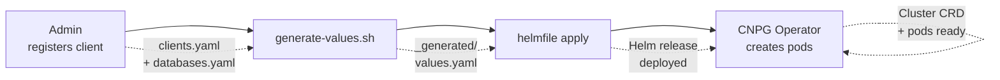

1. Register the client in `confs/admin/{env}/clients.yaml` with `storageProfile`, `s3Bucket`, `s3Credentials`, `ldapCredentials`
2. Create user databases in `confs/users/{INS}/{env}/databases.yaml`
3. Run `make create INS=<client> ENV=<env> DC=<dc>`
4. CNPG operator provisions PostgreSQL pods, creates databases, configures TLS

### CNPG Image Upgrade (Rolling Update)

Zero-downtime PostgreSQL image upgrades using CNPG's built-in rolling update mechanism.

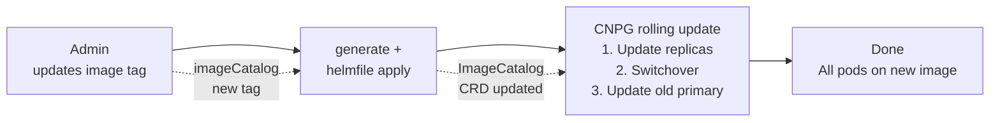

**Steps:**

1. Admin updates the image tag in `confs/admin/{env}/postgresql.yaml`:
   ```yaml
   imageCatalog:
     images:
       - major: 16
         image: ghcr.io/cloudnative-pg/postgresql:16.5-bookworm  # Updated
   ```
2. Run `make upgrade INS=<client> ENV=<env> DC=<dc>`
3. CNPG automatically:
   - Replaces replica pods one by one with the new image
   - Performs a graceful switchover of the primary
   - Replaces the old primary pod

The `primaryUpdateStrategy: unsupervised` and `primaryUpdateMethod: switchover` settings ensure fully automatic, zero-downtime upgrades.

### Switchover (Planned Primary Switch)

Graceful primary failover for planned maintenance (e.g., DC maintenance window).

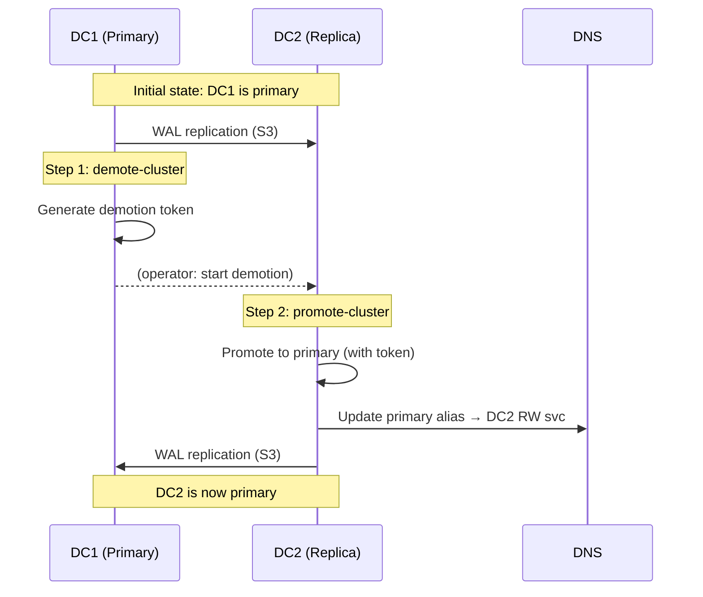

**Steps:**

1. Demote the current primary:
   ```bash
   make demote INS=ic1 ENV=prod NEW_PRIMARY=prod-ic1-dc2
   ```
   This generates a demotion token on the demoted cluster.

2. Promote the target replica (pass the demotion token from step 1):
   ```bash
   make promote INS=ic1 ENV=prod DEMOTION_TOKEN=<token-from-demote>
   ```
   The demotion token comes from the **other** K8s cluster (the demoted DC), so it must be passed explicitly.

3. `promote-cluster.sh` automatically updates the primary DNS alias (`primary.{ins}-{env}.{zone}`) to point to the new primary's RW service.

### Force Promote (Disaster Recovery)

Emergency promotion when the primary datacenter is lost.

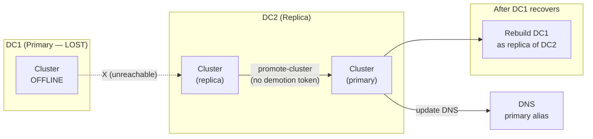

**Steps:**

1. Force promote the surviving replica (no demotion token — omit `DEMOTION_TOKEN`):
   ```bash
   make promote INS=ic1 ENV=prod
   ```
   The script will warn about the DR scenario and prompt for confirmation.

2. `promote-cluster.sh` updates the primary DNS alias to DC2's RW service.

3. After DC1 recovers, rebuild the DC1 cluster as a replica of DC2.

## Primary/Replica Behavior

The `isPrimary` flag is automatically computed by `generate-values.sh` based on the client's replication config and the current datacenter:

- **Primary** (`isPrimary: true`): No explicit `bootstrap` section — CNPG defaults to `initdb` internally. Database CRDs, managed roles, and ScheduledBackup are created.
- **Replica** (`isPrimary: false`): Bootstrap uses WAL `recovery` from the primary cluster's external S3 archive. No Database CRDs or managed roles (replicated via WAL).

```bash
# Primary cluster (dc1 = primaryDatacenter)
make create INS=ic1 ENV=prod DC=dc1   # isPrimary=true

# Replica cluster (dc2 ≠ primaryDatacenter)
make create INS=ic1 ENV=prod DC=dc2   # isPrimary=false
```

## Helmfile Configuration

Single `helmfile.yaml` with label-based selectors:

| Label | Values | Selector |
|-------|--------|----------|
| `component` | `cluster` | `-l component=cluster` |
| `component` | `local-infra` | `-l component=local-infra` |

Releases:
- **cluster**: Core chart with `confs/_generated/{INS}-{ENV}/values.yaml`, requires `INS`, `ENV`, `NAMESPACE`, `CLUSTER_NAME` env vars
- **seaweedfs**: S3-compatible storage in local-infra namespace
- **openldap**: LDAP server in local-infra namespace
- **pgaas-observability**: Prometheus + OTel Collector + Grafana in local-infra namespace (local env only, deployed on first DC)

The cert-manager CA is deployed as a plain K8s manifest (`manifests/cert-manager-ca.yaml`) via `kubectl apply` before helmfile runs.

## Environment Scaling

| Property | local | hp | perf | pprod | prod |
|----------|-------|----|------|-------|------|
| Instances | 1 | 2 | 2 | 3 | 3 |
| max_connections | 50 | 200 | 200 | 300 | 500 |
| Backup retention | 7d | 14d | 14d | 30d | 90d |
| Datacenters | local | dc1 | dc1 | dc1+dc2 | dc1+dc2 |
| Replication | No | No | No | Opt-in | Opt-in |

Storage size and resource limits are determined by the client's assigned `storageProfile` (S/M/L/XXL), not the environment.

## CI/CD

PGaaS provides CI/CD pipelines for both Jenkins and GitLab CI.

### Build Pipeline

Available as `Jenkinsfile` (multibranch pipeline) and `.gitlab-ci.yml`.

**Stages:** Derive Version → Check Tools → Preview → Package → Publish

- **Branch push** (main/develop): runs check-tools + preview only (validation)
- **Tag push** (`v*`): runs all stages including package + publish to Artifactory

**Versioning:**
- Tag `v1.2.3` → version `1.2.3` (release artifact published)
- Branch `main` → version `0.0.0-main.a1b2c3d` (snapshot, not published)

**Artifact:** `pgaas-{version}.zip` containing `scripts/`, `core/`, `confs/admin/`, `manifests/`, `helmfile.yaml`, `Makefile` (excludes `confs/_generated/`, `confs/admin/local/`, `.git*`)

**Auth flow:** Jenkins `APPROLE_CRED` (or GitLab CI/CD variables `VAULT_ROLE_ID`/`VAULT_SECRET_ID`) → Vault AppRole login → Vault token → JFrog deploy token → `curl -T` to Artifactory.

### Deploy Job

Defined in `ci/deploy-job.groovy` (Jenkins Job DSL). Creates a parameterized `pgaas-deploy` pipeline job.

**Parameters:**

| Parameter | Description |
|-----------|-------------|
| `PGAAS_VERSION` | Platform artifact version |
| `USERS_VERSION` | Users config artifact version |
| `INS` | Client INS code(s), comma-separated |
| `ENV` | Target environment (`perf`, `pprod`, `prod`) |
| `ENV_OVERRIDE` | HP sub-env override (e.g., `dev1`, `pic`) |
| `DC` | Datacenter (empty = client default) |
| `ACTION` | `create` or `upgrade` |
| `KUBECONFIG_CRED` | Jenkins credential ID for kubeconfig |

**Deploy stages:** Validate Parameters → Fetch Artifacts (platform + users zips) → Assemble (unzip platform, overlay users into `confs/users/`) → Deploy (loop over INS list: `make ${ACTION} INS=${ins} ENV=${env}`)

Multi-INS deployments are sequential for clear failure attribution per client.

## Local Development Setup (Multi-DC)

This guide covers setting up a local multi-datacenter environment using two minikube profiles (`cluster1`/`cluster2`) simulating two datacenters (`local1`/`local2`). SeaweedFS is shared — only cluster1 runs it, and both clusters reference it by `minikube ip -p cluster1`.

### Prerequisites

- [minikube](https://minikube.sigs.k8s.io/) installed
- [Helm](https://helm.sh/) v3.x
- [Helmfile](https://github.com/helmfile/helmfile)
- [kubectl](https://kubernetes.io/docs/tasks/tools/)
- [yq](https://github.com/mikefarah/yq) v4.x
- [cert-manager](https://cert-manager.io/) (installed per cluster below)
- [CNPG operator](https://cloudnative-pg.io/) (installed per cluster below)
- `aws` CLI or `curl` (for SeaweedFS S3 testing)
- `ldapsearch` (for OpenLDAP testing, part of `ldap-utils`)

Check tools: `make check-tools`

### 1. Create minikube profiles

```bash
minikube start -p cluster1 --cpus=2 --memory=4096 --addons=default-storageclass
minikube start -p cluster2 --cpus=2 --memory=4096 --addons=default-storageclass
```

### 2. Install cert-manager on both clusters

```bash
# cluster1
kubectl --context cluster1 apply -f https://github.com/cert-manager/cert-manager/releases/latest/download/cert-manager.yaml
kubectl --context cluster1 -n cert-manager wait --for=condition=Available deployment --all --timeout=120s

# cluster2
kubectl --context cluster2 apply -f https://github.com/cert-manager/cert-manager/releases/latest/download/cert-manager.yaml
kubectl --context cluster2 -n cert-manager wait --for=condition=Available deployment --all --timeout=120s
```

### 3. Install CNPG operator on both clusters

```bash
# cluster1
helm repo add cnpg https://cloudnative-pg.github.io/charts
helm upgrade --install cnpg cnpg/cloudnative-pg --kube-context cluster1 -n cnpg-system --create-namespace --wait

# cluster2
helm upgrade --install cnpg cnpg/cloudnative-pg --kube-context cluster2 -n cnpg-system --create-namespace --wait
```

### 4. Deploy local infrastructure

```bash
make infra-install
```

This deploys cert-manager CA + OpenLDAP on both clusters, and SeaweedFS + the observability stack (Prometheus, OTel Collector, Grafana) on cluster1 only (shared). At the end it prints the SeaweedFS NodePort URL and the Grafana NodePort URL.

### 5. Update S3 endpoint

After `make infra-install` prints the SeaweedFS URL (e.g., `http://192.168.49.2:30333`), update `confs/admin/local/datacenters.yaml`:

```yaml
datacenters:
  local1:
    kubeContext: cluster1
    dnsSuffix: svc.cluster.local
    s3:
      endpoint: "http://192.168.49.2:30333"   # <-- replace with printed URL
      region: us-east-1
  local2:
    kubeContext: cluster2
    dnsSuffix: svc.cluster.local
    s3:
      endpoint: "http://192.168.49.2:30333"   # <-- same URL (shared SeaweedFS)
      region: us-east-1
```

### 6. Test local infrastructure

```bash
make infra-test
```

This verifies SeaweedFS S3 API (bucket create/put/get/delete) and OpenLDAP LDAP connectivity on all DCs.

### 7. Deploy primary cluster on cluster1

```bash
make create INS=ic1 ENV=local DC=local1
```

### 8. Deploy replica cluster on cluster2

```bash
make create INS=ic1 ENV=local DC=local2
```

### 9. Verify

```bash
make status INS=ic1 ENV=local DC=local1   # primary
make status INS=ic1 ENV=local DC=local2   # replica
```

### 10. Test switchover

```bash
# Demote primary (cluster1)
make demote INS=ic1 ENV=local DC=local1 NEW_PRIMARY=local-ic1-local2
# Copy the demotion token from the output

# Promote replica (cluster2) with the token
make promote INS=ic1 ENV=local DC=local2 DEMOTION_TOKEN=<token>
# promote-cluster.sh also updates the primary DNS alias
```

### Single-DC shortcut

For simpler local development without replication, just use one DC:

```bash
make infra-install DC=local1
make create INS=ic1 ENV=local DC=local1
```

You can set `replication.enabled: false` in `confs/admin/local/clients.yaml` for a single-DC setup.

### Teardown

```bash
# Delete clusters
make delete INS=ic1 ENV=local DC=local1
make delete INS=ic1 ENV=local DC=local2

# Delete infrastructure
make infra-delete

# Delete minikube profiles
minikube delete -p cluster1
minikube delete -p cluster2
```

## Prerequisites

- Kubernetes cluster with [CNPG operator](https://cloudnative-pg.io/) installed
- [cert-manager](https://cert-manager.io/) installed
- [Helm](https://helm.sh/) v3.x
- [Helmfile](https://github.com/helmfile/helmfile)
- [yq](https://github.com/mikefarah/yq) v4.x (for value generation)
- kubectl configured for target cluster
- (Real envs) [HashiCorp Vault](https://www.vaultproject.io/) or [external-secrets-operator](https://external-secrets.io/) for S3 credential and LDAP bind password synchronization
- (Real envs) [ExternalDNS](https://github.com/kubernetes-sigs/external-dns) for automatic DNS alias management

Run `make check-tools` to verify all required CLI tools are installed.
